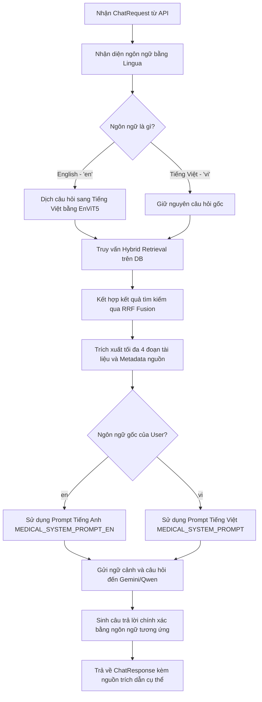

# Tài liệu Chi tiết Dự án (Project Details)

Tài liệu này cung cấp cái nhìn toàn diện về cấu trúc thư mục, chức năng chi tiết của từng thành phần, sơ đồ luồng dữ liệu, và hướng dẫn tích hợp chi tiết (kèm mã nguồn Java) để gọi API của hệ thống **Medical RAG (Retrieval-Augmented Generation)** từ ứng dụng Web của bạn.

---

## 1. Mục đích của Tài liệu này
Tài liệu này được biên soạn để giúp:
1. **Đội ngũ Phát triển Web (Java/Backend):** Nắm rõ cấu trúc API, định dạng Payload đầu vào/đầu ra, và cách tích hợp gọi dịch vụ Python từ phía Java một cách tối ưu.
2. **Kỹ sư AI/Hệ thống:** Hiểu rõ các lớp kiến trúc (Clean Architecture) của dự án, phục vụ mục đích bảo trì, mở rộng hoặc hoán đổi các mô hình AI (như đổi Gemini sang OpenAI, đổi ChromaDB sang Qdrant/Milvus).
3. **Quản trị viên Hệ thống:** Biết cách cấu hình tham số hệ thống thông qua biến môi trường (`.env`) và chạy máy chủ ở chế độ sản xuất (Production).

---

## 2. Cấu trúc Thư mục và Chức năng Chi tiết

Hệ thống được thiết kế theo mô hình **Kiến trúc Sạch (Clean Architecture)** nhằm cô lập logic nghiệp vụ lõi (Domain/Services) khỏi các thư viện và dịch vụ hạ tầng bên ngoài (Infrastructure/API).

Dưới đây là cây thư mục chi tiết và chức năng của từng file:

```text
medical-rag/
├── api/                           # Lớp Giao tiếp & Định tuyến API (FastAPI)
│   ├── v1/
│   │   ├── chat.py                # Router định nghĩa endpoint /api/v1/chat nhận yêu cầu RAG
│   │   └── __pycache__/
│   ├── dependencies.py            # Quản lý Dependency Injection và Singleton Services (Tránh tải lại mô hình AI gây tràn RAM)
│   └── __pycache__/
├── core/                          # Lớp Cấu hình, Nhật ký & Ngoại lệ của hệ thống
│   ├── config.py                  # Đọc biến môi trường từ .env và định nghĩa cấu hình hệ thống (Settings)
│   ├── exceptions.py              # Định nghĩa các lớp lỗi tùy chỉnh phục vụ kiểm soát lỗi
│   ├── logging.py                 # Thiết lập cấu hình log tập trung (logger) cho toàn hệ thống
│   └── __pycache__/
├── data/                          # Cơ sở dữ liệu vật lý và dữ liệu thô
│   ├── bm25/                      # Thư mục lưu chỉ mục tìm kiếm văn bản BM25 (sparse index)
│   │   └── bm25_index.pkl
│   ├── chromadb/                  # Thư mục lưu cơ sở dữ liệu Vector ChromaDB (dense store)
│   ├── raw/                       # Thư mục chứa tài liệu y tế định dạng Markdown phân chia theo bệnh lý
│   │   ├── cúm/                   # Tài liệu chi tiết về bệnh cúm
│   │   ├── hen suyễn/             # Tài liệu chi tiết về bệnh hen suyễn
│   │   ├── thiếu máu/             # Tài liệu chi tiết về bệnh thiếu máu
│   │   ├── tiểu đường/            # Tài liệu chi tiết về bệnh tiểu đường
│   │   └── tăng huyết áp/          # Tài liệu chi tiết về bệnh tăng huyết áp
├── domain/                        # Lớp Nghiệp vụ cốt lõi (Domain Core - Không phụ thuộc framework/thư viện bên ngoài)
│   ├── interfaces.py              # Định nghĩa các Interfaces/Contracts (ILanguageDetector, ITranslator, IVectorStore, etc.)
│   ├── models.py                  # Các Pydantic Models định nghĩa cấu trúc dữ liệu đầu vào/đầu ra (Request/Response)
│   └── __pycache__/
├── infrastructure/                # Lớp Hạ tầng (Triển khai các Interfaces từ Domain)
│   ├── llm/                       # Triển khai kết nối tới các dịch vụ mô hình ngôn ngữ lớn (LLM Providers)
│   │   ├── gemini_service.py      # Tích hợp với Google Gemini API (gemini-2.5-flash)
│   │   ├── qwen_service.py        # Tích hợp với Alibaba Qwen API (qwen-max) qua OpenAI-compatible API
│   │   └── __pycache__/
│   ├── embeddings.py              # Triển khai nhúng văn bản bằng mô hình BAAI/bge-m3 (Dense Embeddings)
│   ├── language_detector.py       # Tự động nhận diện ngôn ngữ sử dụng thư viện Lingua
│   ├── retrievers.py              # Xây dựng các bộ tìm kiếm thông tin (Dense, Sparse, và Hybrid RRF Fusion)
│   ├── translator.py              # Tích hợp bộ dịch song ngữ En-Vi qua API EnViT5
│   ├── vectorstore.py             # Kết nối và thao tác với ChromaDB (lưu trữ và tìm kiếm vector)
│   └── __pycache__/
├── prompts/                       # Quản lý các mẫu gợi ý (Prompt Engineering) cho AI
│   └── medical_prompt.py          # Lưu trữ MEDICAL_SYSTEM_PROMPT (Tiếng Việt) và MEDICAL_SYSTEM_PROMPT_EN (Tiếng Anh)
├── scripts/                       # Các kịch bản chạy thử nghiệm, nạp dữ liệu và kiểm thử
│   ├── ingest_documents.py        # Kịch bản nạp và phân mảnh tài liệu từ data/raw vào ChromaDB & tạo chỉ mục BM25
│   ├── test.py                    # Script kiểm tra nhanh tìm kiếm tương đồng trên ChromaDB
│   ├── verify_hybrid_rag.py       # Script kiểm tra chi tiết cả 3 luồng: Dense, Sparse và Hybrid Search kèm RAG Pipeline
│   ├── verify_rag.py              # Script kiểm tra nhanh luồng chạy RAG Pipeline đầu cuối (E2E)
│   └── __pycache__/
├── services/                      # Lớp Điều phối (Application Use-cases)
│   ├── rag_pipeline.py            # Lớp MedicalRAGPipeline chịu trách nhiệm điều phối toàn bộ vòng đời RAG
│   └── __pycache__/
├── .env                           # File cấu hình biến môi trường cục bộ (API Keys, đường dẫn database, cấu hình LLM,...)
├── main.py                        # Điểm khởi chạy ứng dụng FastAPI (kích hoạt CORS, nạp cấu hình, cấu hình endpoints)
├── README.md                      # Tài liệu tổng quan dự án cho nhà phát triển
└── requirements.txt               # Danh sách các thư viện Python phụ thuộc cần cài đặt
```

---

## 3. Quy trình Xử lý Dữ liệu trong RAG Pipeline
Khi một request API `/api/v1/chat` được gửi tới:



---

## 4. Đặc tả API Endpoint (API Specification)

### Chat Endpoint
* **URL:** `/api/v1/chat`
* **Method:** `POST`
* **Headers:** `Content-Type: application/json`

#### Request Body
```json
{
  "message": "cúm là gì và triệu chứng như thế nào?"
}
```
*Hoặc câu hỏi tiếng Anh:*
```json
{
  "message": "What is the common cold and its symptoms?"
}
```

#### Response Body (200 OK)
```json
{
  "answer": "Bệnh cúm (influenza) là bệnh nhiễm trùng đường hô hấp cấp tính do virus cúm gây ra...\nCác triệu chứng thường gặp bao gồm:\n- Sốt cao đột ngột (trên 38 độ C)\n- Ho khan, đau họng\n- Đau nhức cơ bắp toàn thân\n- Mệt mỏi kéo dài...",
  "detected_language": "vi",
  "translated_query": null,
  "sources": [
    {
      "title": "Bệnh cúm - Triệu chứng và Điều trị",
      "source": "cúm_vinmec.md",
      "url": "https://www.vinmec.com/vi/tin-tuc/thong-tin-suc-khoe/suckhoe-thuongthuc/cum-la-gi-trieu-chung-nguyen-nhan-va-cach-phong-ngua/"
    }
  ]
}
```

#### Bảng cấu trúc chi tiết phản hồi
| Trường | Kiểu dữ liệu | Ý nghĩa |
| :--- | :--- | :--- |
| `answer` | `String` | Câu trả lời y khoa do LLM sinh ra dựa trên tài liệu tham khảo bằng đúng ngôn ngữ gốc của câu hỏi. |
| `detected_language` | `String` | Ngôn ngữ phát hiện của câu hỏi (`vi` hoặc `en`). |
| `translated_query` | `String` (Nullable) | Câu hỏi sau khi dịch sang Tiếng Việt (nếu đầu vào là Tiếng Anh). Nếu đầu vào là Tiếng Việt, trường này sẽ là `null`. |
| `sources` | `Array` | Danh sách tài liệu tham chiếu được trích xuất từ database phục vụ cho việc đối chứng thông tin. |

---

## 5. Hướng dẫn Tích hợp với Web App (Java)

Để tích hợp hệ thống RAG này vào ứng dụng Java (ví dụ: Spring Boot, Java Web thông thường), bạn có thể sử dụng `HttpClient` được tích hợp sẵn từ Java 11+ hoặc thư viện bên thứ ba như `RestTemplate`, `WebClient` hay `OkHttp`.

Dưới đây là một ví dụ mẫu hoàn chỉnh sử dụng **Java 11+ HttpClient**:

```java
import java.net.URI;
import java.net.http.HttpClient;
import java.net.http.HttpRequest;
import java.net.http.HttpResponse;
import java.time.Duration;

public class MedicalRagClient {

    private static final String RAG_API_URL = "http://127.0.0.1:8000/api/v1/chat";
    private final HttpClient httpClient;

    public MedicalRagClient() {
        // Khởi tạo HttpClient với cấu hình timeout
        this.httpClient = HttpClient.newBuilder()
                .connectTimeout(Duration.ofSeconds(10))
                .build();
    }

    /**
     * Gửi câu hỏi y tế tới hệ thống RAG và nhận kết quả JSON
     * 
     * @param userMessage Câu hỏi bằng Tiếng Anh hoặc Tiếng Việt
     * @return Chuỗi JSON trả về từ FastAPI
     * @throws Exception Các lỗi về mạng hoặc timeout
     */
    public String askMedicalChatbot(String userMessage) throws Exception {
        // Tạo JSON payload thủ công hoặc thông qua Jackson/Gson (Khuyên dùng ObjectMapper của Jackson)
        // Ví dụ này sử dụng định dạng chuỗi thô để dễ chạy standalone
        String jsonPayload = String.format("{\"message\": \"%s\"}", escapeJson(userMessage));

        HttpRequest request = HttpRequest.newBuilder()
                .uri(URI.create(RAG_API_URL))
                .header("Content-Type", "application/json")
                .header("Accept", "application/json")
                .POST(HttpRequest.BodyPublishers.ofString(jsonPayload))
                .timeout(Duration.ofSeconds(30)) // RAG Pipeline cần thời gian suy luận và dịch thuật
                .build();

        HttpResponse<String> response = this.httpClient.send(request, HttpResponse.BodyHandlers.ofString());

        if (response.statusCode() == 200) {
            return response.body();
        } else {
            throw new RuntimeException("Lỗi từ hệ thống RAG API: HTTP Status " + response.statusCode() + " - " + response.body());
        }
    }

    private String escapeJson(String input) {
        if (input == null) return "";
        return input.replace("\\", "\\\\")
                    .replace("\"", "\\\"")
                    .replace("\n", "\\n")
                    .replace("\r", "\\r")
                    .replace("\t", "\\t");
    }

    public static void main(String[] args) {
        MedicalRagClient client = new MedicalRagClient();
        
        try {
            System.out.println("--- ĐANG GỬI CÂU HỎI TIẾNG VIỆT ---");
            String viResponse = client.askMedicalChatbot("Triệu chứng của tiểu đường type 2 là gì?");
            System.out.println("Kết quả:\n" + viResponse);

            System.out.println("\n--- ĐANG GỬI CÂU HỎI TIẾNG ANH ---");
            String enResponse = client.askMedicalChatbot("What are the main causes of hypertension?");
            System.out.println("Kết quả:\n" + enResponse);

        } catch (Exception e) {
            e.printStackTrace();
        }
    }
}
```

---

## 6. Hướng dẫn Triển khai và Khởi chạy Phía Python

1. **Chuẩn bị môi trường ảo:**
   ```powershell
   python -m venv venv
   .\venv\Scripts\activate
   pip install -r requirements.txt
   ```
2. **Cấu hình môi trường (`.env`):**
   Hãy chắc chắn rằng file `.env` ở thư mục gốc của bạn đã cấu hình chính xác `GEMINI_API_KEY` hoặc `QWEN_API_KEY`.
3. **Chạy Server:**
   ```powershell
   python -m uvicorn main:app --host 0.0.0.0 --port 8000 --reload
   ```
   *Lưu ý:* Tham số `--host 0.0.0.0` giúp server Python lắng nghe từ mọi card mạng, cho phép dịch vụ Java (dù nằm trên cùng máy hay trên Docker container/Server khác) dễ dàng kết nối tới thông qua IP LAN hoặc localhost.
