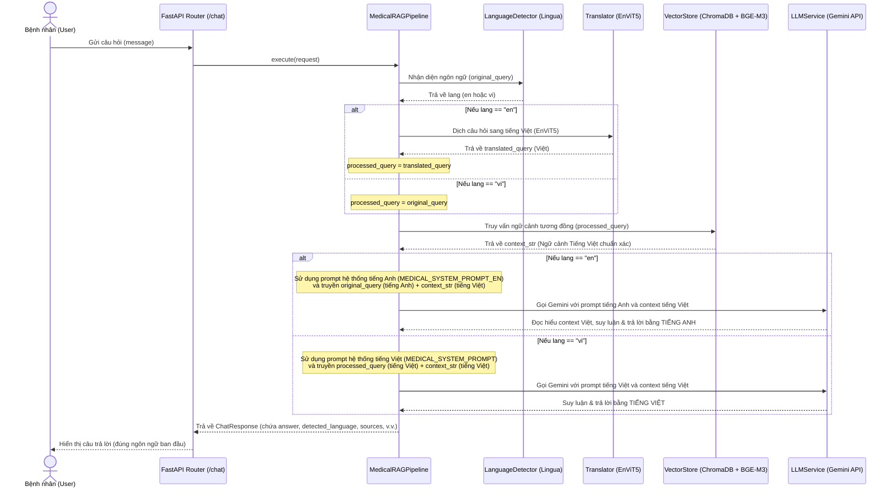

# Hệ thống Medical RAG Đa Ngữ (Multilingual Medical RAG)

Hệ thống **Medical RAG (Retrieval-Augmented Generation)** là giải pháp tra cứu thông tin y tế chuyên sâu, kết hợp sức mạnh tìm kiếm ngữ nghĩa trên cơ sở dữ liệu y học tiếng Việt chuẩn xác (ChromaDB) với khả năng suy luận mạnh mẽ của mô hình ngôn ngữ lớn (LLM - Google Gemini).

Hệ thống hỗ trợ tính năng **"Đa ngôn ngữ đầu ra dựa trên đầu vào" (Multilingual Output based on Input)**:
- Người dùng có thể hỏi bằng **Tiếng Việt** hoặc **Tiếng Anh**.
- Dữ liệu tri thức nội bộ được lưu trữ và truy vấn hoàn toàn bằng **Tiếng Việt** để đảm bảo tính đồng nhất và độ chính xác chuyên môn cao nhất.
- Câu trả lời trả về cho bệnh nhân sẽ tự động khớp với ngôn ngữ câu hỏi ban đầu (Tiếng Anh trả về Tiếng Anh, Tiếng Việt trả về Tiếng Việt) nhờ cơ chế định hướng prompt thông minh của RAG Pipeline.

---

## 1. Sơ đồ luồng hoạt động (Workflow Sequence Diagram)

Dưới đây là sơ đồ chi tiết biểu diễn luồng dữ liệu từ khi nhận câu hỏi của bệnh nhân cho đến khi trả về câu trả lời cuối cùng:



---

## 2. Chức năng chi tiết từng thành phần (Components Description)

Hệ thống được thiết kế theo kiến trúc hướng cổng và giao diện (Interface-Driven Development) giúp dễ dàng hoán đổi các dịch vụ hạ tầng:

### A. Bộ nhận diện ngôn ngữ (`Language Detector`)
- **File triển khai**: [language_detector.py](file:///c:/Users/Admin/Desktop/TTCS/chatbot/medical-rag/infrastructure/language_detector.py)
- **Công nghệ**: Sử dụng thư viện `lingua-language-detector`, tối ưu hóa nhận diện giữa hai ngôn ngữ đích là **Tiếng Việt** và **Tiếng Anh**.
- **Chức năng**: Phát hiện chính xác ngôn ngữ của câu hỏi đầu vào để thiết lập biến `lang`.

### B. Bộ dịch thuật truy vấn (`Translator`)
- **File triển khai**: [translator.py](file:///c:/Users/Admin/Desktop/TTCS/chatbot/medical-rag/infrastructure/translator.py)
- **Công nghệ**: Kết nối tới mô hình dịch thuật song ngữ chuyên sâu `EnViT5` qua API nội bộ.
- **Chức năng**: Dịch các câu hỏi Tiếng Anh (`lang == "en"`) sang Tiếng Việt. Điều này cực kỳ quan trọng vì cơ sở dữ liệu y tế của hệ thống là tiếng Việt; việc dịch truy vấn giúp tìm kiếm ngữ nghĩa (semantic search) trên ChromaDB đạt độ chính xác cao nhất.

### C. Bộ tạo Vector & Cơ sở dữ liệu Vector (`Embedding Service & Vector Store`)
- **File triển khai**: [embeddings.py](file:///c:/Users/Admin/Desktop/TTCS/chatbot/medical-rag/infrastructure/embeddings.py) và [vectorstore.py](file:///c:/Users/Admin/Desktop/TTCS/chatbot/medical-rag/infrastructure/vectorstore.py)
- **Công nghệ**: Mô hình nhúng đa ngôn ngữ `BAAI/bge-m3` kết hợp cơ sở dữ liệu vector `ChromaDB`.
- **Chức năng**:
  - Chuyển đổi câu hỏi tiếng Việt sau xử lý thành vector biểu diễn số học.
  - Thực hiện tìm kiếm láng giềng gần nhất (k-NN) để lấy ra tối đa 4 đoạn văn bản (chunks) y học liên quan nhất kèm theo metadata (tiêu đề, tên nguồn file, URL nguồn gốc).

### D. Bộ điều phối Prompt và Sinh câu trả lời (`RAG Pipeline & LLM Service`)
- **File triển khai**: [rag_pipeline.py](file:///c:/Users/Admin/Desktop/TTCS/chatbot/medical-rag/services/rag_pipeline.py) và [gemini_service.py](file:///c:/Users/Admin/Desktop/TTCS/chatbot/medical-rag/infrastructure/llm/gemini_service.py)
- **Công nghệ**: Google Gemini API (`gemini-2.5-flash`).
- **Chức năng**:
  - **Khi đầu vào là Tiếng Việt (`lang == "vi"`)**: Sử dụng prompt hệ thống tiếng Việt `MEDICAL_SYSTEM_PROMPT`. Gemini sẽ đọc tài liệu tiếng Việt, trả lời bằng tiếng Việt mạch lạc, định cấu trúc rõ ràng và tuân thủ các nguyên tắc an toàn y tế.
  - **Khi đầu vào là Tiếng Anh (`lang == "en"`)**: Sử dụng prompt hệ thống tiếng Anh `MEDICAL_SYSTEM_PROMPT_EN`. Câu hỏi gửi đến LLM là câu hỏi tiếng Anh gốc (`original_query`), kết hợp với ngữ cảnh tiếng Việt (`context_str`). Điều này ép Gemini vận dụng khả năng đọc hiểu đa ngôn ngữ để dịch chuyển thông tin từ ngữ cảnh tiếng Việt, suy luận và phản hồi lại bằng tiếng Anh chuẩn xác.

---

## 3. Cấu hình chi tiết Prompts (Prompt Engineering)

Các prompt được lưu trữ tập trung tại [medical_prompt.py](file:///c:/Users/Admin/Desktop/TTCS/chatbot/medical-rag/prompts/medical_prompt.py):

### Prompt Tiếng Việt (`MEDICAL_SYSTEM_PROMPT`)
Đảm bảo trợ lý ảo phản hồi hoàn toàn bằng tiếng Việt, chỉ dựa vào ngữ cảnh được cung cấp, không bịa đặt thông tin và luôn kèm lời nhắc an toàn y tế thân thiện.

### Prompt Tiếng Anh (`MEDICAL_SYSTEM_PROMPT_EN`)
Được thiết kế tương đương về mặt ràng buộc pháp lý và y tế, chỉ thị cho Gemini sinh câu trả lời bằng tiếng Anh, dịch và tóm tắt thông tin một cách tự nhiên từ ngữ cảnh tiếng Việt được cung cấp.

---

## 4. Hướng dẫn thiết lập và chạy hệ thống

### Bước 1: Khởi tạo môi trường ảo và cài đặt dependencies
1. Tạo venv (nếu chưa có):
   ```powershell
   python -m venv venv
   ```
2. Kích hoạt môi trường ảo:
   ```powershell
   # Trên Windows
   .\venv\Scripts\activate
   ```
3. Cài đặt các thư viện cần thiết:
   ```powershell
   pip install -r requirements.txt
   ```

### Bước 2: Thiết lập cấu hình `.env`
Kiểm tra file `.env` tại thư mục gốc dự án đã cấu hình đầy đủ API Key:
```env
ENV=development
LOG_LEVEL=INFO
LLM_PROVIDER=gemini
GEMINI_API_KEY=YOUR_GEMINI_API_KEY
GEMINI_MODEL_NAME=gemini-2.5-flash
USE_CUDA=false
ENVIT5_API_URL=https://subplot-strep-ragweed.ngrok-free.dev/predict
```

### Bước 3: Khởi chạy API Server
Khởi chạy dịch vụ FastAPI bằng Uvicorn:
```powershell
python -m uvicorn main:app --reload
```
Server sẽ chạy mặc định tại: `http://127.0.0.1:8000`. Bạn có thể truy cập tài liệu API tự động tại `http://127.0.0.1:8000/docs`.
